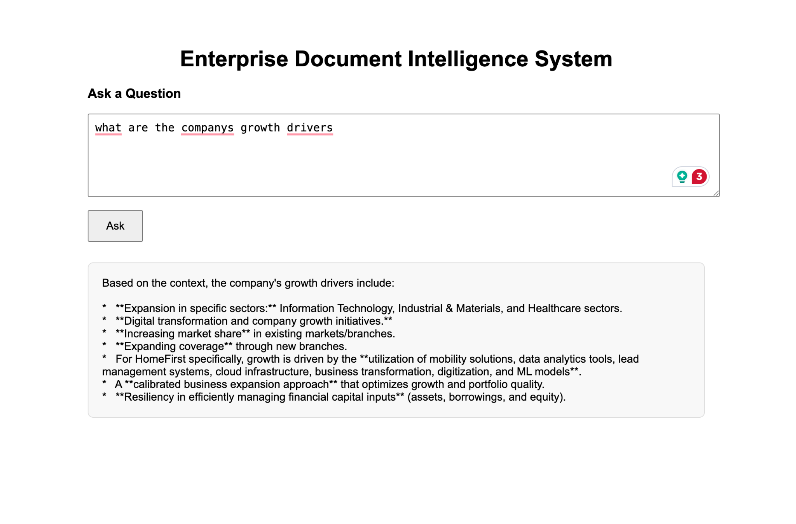

# Enterprise Document Intelligence System
<p align="center">
  
</p>


## Overview

Enterprise Document Intelligence System is a Retrieval-Augmented Generation (RAG) platform built using Django, LangChain, FAISS, HuggingFace Embeddings, and Google's Gemini LLM.

The system allows users to upload enterprise documents, convert them into vector embeddings, perform semantic retrieval, and ask natural language questions about document contents through an interactive web interface.

Unlike traditional keyword search systems, this platform uses vector search to retrieve contextually relevant information and generate answers grounded in the uploaded documents.

---

## Features

- PDF Document Upload and Management
- Document Metadata Storage
- Automated Text Chunking
- Semantic Embedding Generation
- FAISS Vector Database Integration
- Context-Aware Retrieval
- Gemini-Powered Question Answering
- Django REST API Backend
- Interactive Frontend Interface
- Retrieval-Augmented Generation (RAG)

---

## Tech Stack

### Backend

- Django
- Django ORM
- PostgreSQL / SQLite

### AI & Retrieval

- LangChain
- Google Gemini 2.5 Flash
- HuggingFace Embeddings
- Sentence Transformers
- FAISS

### Frontend

- HTML
- CSS
- JavaScript

---

## System Architecture

```text
PDF Document
      │
      ▼
PDF Extraction
      │
      ▼
Text Chunking
      │
      ▼
Embedding Generation
(HuggingFace MiniLM-L6-v2)
      │
      ▼
FAISS Vector Store
      │
      ▼
Similarity Search
      │
      ▼
Relevant Chunks
      │
      ▼
Gemini 2.5 Flash
      │
      ▼
Final Answer
```

---

## Project Structure

```text
Enterprise Document Intelligence System
│
├── document_platform/
│   ├── settings.py
│   ├── urls.py
│   └── wsgi.py
│
├── documents/
│   ├── models.py
│   ├── views.py
│   └── services/
│       └── qa_service.py
│
├── templates/
│   └── index.html
│
├── faiss_index/
│
├── media/
│
├── manage.py
├── requirements.txt
└── README.md
```

---

## How the System Works

### Step 1: Upload a PDF

A PDF document is uploaded through the Django backend.

The system stores:

- File Name
- File Path
- File Size
- Processing Status

in the database.

---

### Step 2: Extract and Chunk Text

The PDF contents are extracted and split into smaller chunks.

Example:

```text
Annual Report
      │
      ▼
Chunk 1
Chunk 2
Chunk 3
Chunk 4
...
```

Chunking improves retrieval accuracy and prevents LLM context overload.

---

### Step 3: Generate Embeddings

The project uses:

```python
sentence-transformers/all-MiniLM-L6-v2
```

Each chunk is converted into a semantic vector.

### Embedding Details

| Property | Value |
|-----------|--------|
| Model | all-MiniLM-L6-v2 |
| Vector Dimension | 384 |
| Type | Dense Embeddings |

Example:

```text
Chunk Text
      │
      ▼
[0.125, -0.442, 0.817, ...]
```

---

### Step 4: Store in FAISS

Generated embeddings are stored in a FAISS vector index.

Benefits:

- Fast Similarity Search
- Semantic Retrieval
- Scalable Vector Storage

---

### Step 5: Ask Questions

Users enter a question through the web interface.

Example:

```text
What are the company growth drivers?
```

The system converts the question into an embedding and performs similarity search against the vector database.

---

### Step 6: Retrieve Relevant Chunks

The most relevant document chunks are retrieved.

```python
results = vector_store.similarity_search(
    question,
    k=5
)
```

The top 5 matching chunks are used as context.

---

### Step 7: Generate an Answer

The retrieved chunks are combined into a prompt:

```text
Context:
[Retrieved Chunks]

Question:
[User Question]
```

This prompt is sent to Gemini 2.5 Flash.

Gemini generates a final answer using only the retrieved context.

---

## Retrieval-Augmented Generation (RAG)

### Traditional LLM

```text
Question
   │
   ▼
LLM
   │
   ▼
Possible Hallucination
```

### RAG Pipeline

```text
Question
   │
   ▼
Retriever
   │
   ▼
Relevant Context
   │
   ▼
Gemini
   │
   ▼
Grounded Answer
```

This significantly reduces hallucinations and improves factual accuracy.

---

## API Endpoints

### Home Page

```http
GET /
```

Loads the frontend interface.

---

### List Documents

```http
GET /documents/
```

Returns all uploaded documents.

---

### Upload PDF

```http
POST /upload-pdf/
```

Uploads and stores a PDF document.

---

### Ask a Question

```http
POST /ask/
```

Request:

```json
{
  "question": "What are the company growth drivers?"
}
```

Response:

```json
{
  "question": "What are the company growth drivers?",
  "answer": "The company's growth would be fuelled by..."
}
```

---

## Screenshots

### Growth Drivers Query


The system retrieves relevant sections from the annual report and identifies:

- Market Share Expansion
- New Branch Expansion
- Digital Transformation
- Analytics Adoption
- Business Transformation Initiatives

---

### Financial Health Query


The system provides an answer grounded in available context and avoids fabricating financial information not present in retrieved sections.

---

### Out-of-Scope Query


Question:

```text
Who is the President of India?
```

Response:

```text
Based on the context provided, there is no information about the President of India.
```

This demonstrates that the RAG pipeline remains grounded in the uploaded document instead of using external knowledge.

---

## Key Technical Concepts Demonstrated

- Django Backend Development
- REST API Design
- Document Processing Pipelines
- Vector Databases
- Semantic Search
- Retrieval-Augmented Generation
- LangChain Integration
- FAISS Indexing
- Prompt Engineering
- LLM Application Development

---

## Future Enhancements

- Automatic PDF Processing After Upload
- Multi-Document Retrieval
- Source Citations with Page References
- PostgreSQL Integration
- User Authentication
- Role-Based Access Control (RBAC)
- Conversation Memory
- LangGraph Workflows
- Enterprise Dashboard
- Document Versioning

---

## Author

**Aarav Jhawar**

Built as a practical implementation of Retrieval-Augmented Generation (RAG) systems for enterprise document intelligence, semantic search, and AI-powered document question answering.
